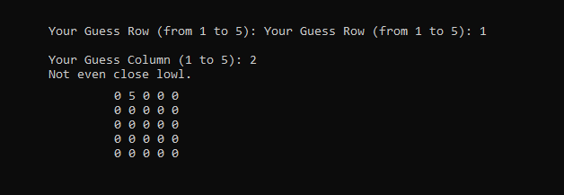

# Battleships
Alone or with a friend, you can play battleships and try to guess where the opponent battleship is hidden in a map. 

Thanks to the immersive AI guiding you throughout the game you can enjoy this experience with or without friends. 
Well written algorithm, takes care of all possibilities and outcomes without letting any room for a bug.

## How to run

To get started you can `git clone  https://github.com/DYasser/RandomNum_C-.git` and have `C++` installed and initialized. You can run the file then by running the main class using an IDE for it.

## Interesting Code

I will show in details here what was described briefly above.



```C++
while(GuessRow != RandRow || GuessCol != RandCol)
{
    cout << "Your Guess Row (from 1 to 5): ";
    cin >> GuessRow;

    while (GuessRow > 5 || GuessRow <1 || !cin.good())
      {
        cin.clear();
        cin.ignore(INT_MAX, '\n');
        cout << "I guess it was too hard for you to pick a number from 1 to 5: ";
        cin >> GuessRow;
      }
    cout << "\nYour Guess Column (1 to 5): ";

    cin >> GuessCol;

    while (GuessCol > 5 || GuessCol <1 || !cin.good())
      {
        cin.clear();
        cin.ignore(INT_MAX, '\n');
        cout << "I guess people nowadays don't go to school anymore, figure what you did wrong: ";
        cin >> GuessCol;
      }

  Guess++;
  cout << "Not even close lowl.\n";
  Table1[GuessRow-1][GuessCol-1] = 5;
  PrintT();
}
```

In the code above is when the user is prompted to guess a row and column. I taked care of all the potential bugs such as inputing a letter, or not inputing anything or even typing a number outside the range. 

When the user takes one of those illegal choices, the program informs him of his/her error and is being prompted to correct it.

```C++
if(GuessRow == RandRow && GuessCol == RandCol)
{
  cout << "You won, well lucky I guess.";
  cout << "\nWith a beautiful number " << Guess << " of Guesses.";
  cout << "\nWhich means, you got a score of " << 2500 - (Guess-1)*100;
  cout << "\nThe Max Score is 2500...";
}
```

When the user get the correct guess, he then gets out of the game loop and is being displayed a victory message.

And finally most importantly, the function responsible of printing the table. 

```C++
int PrintT()//print table 1
{
  for(int row=0; row < 5; row++)
  {
    for(int column = 0; column < 5 ;column++)
    {
      cout << " " << Table1[row][column];
    }
    cout << endl;
  }
}
```

It is a simple nested for loop that prints the table and shows where the user already guessed by writing `5` in the places guessed.

>     This is the end of my documentation
